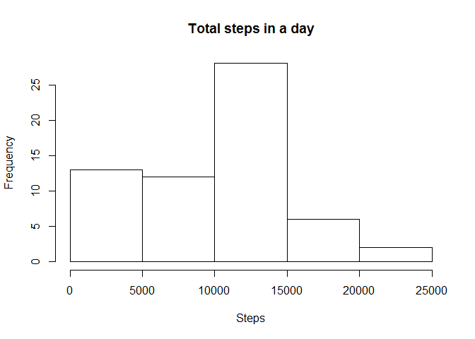
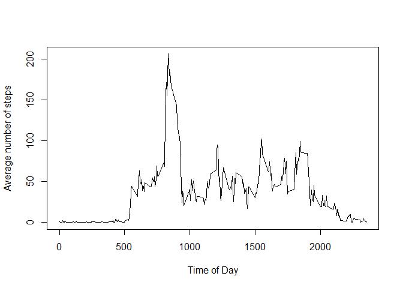
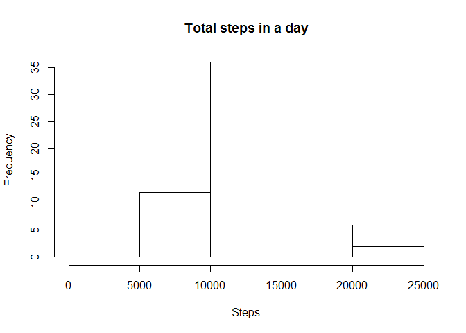
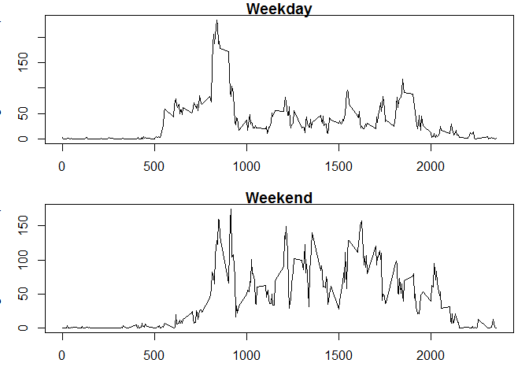

# Reproducible Research: Peer Assessment 1


## Loading and preprocessing the data

```r
data <- read.csv(file("activity.csv"), colClasses = c("integer", "Date", "integer"))
```

## What is mean total number of steps taken per day?

```r
total <- tapply(data$steps, as.factor(data$date), FUN = sum, na.rm = TRUE)
hist(total, main = "Total steps in a day", xlab = "Steps")
```

 

```r
mean(total)
```

```
## [1] 9354.23
```

```r
median(total)
```

```
## [1] 10395
```


## What is the average daily activity pattern?

```r
pattern <- tapply(data$steps, as.factor(data$interval), mean, na.rm = TRUE)
plot(as.numeric(names(pattern)), pattern, type = "l", xlab = "Time of Day", ylab = "Average number of steps")
```

 

```r
pattern[match(max(pattern), pattern)]
```

```
##      835 
## 206.1698
```

## Imputing missing values

```r
numberOfNAs <- sum(is.na(data$steps))
numberOfNAs
```

```
## [1] 2304
```

```r
imputedData <- data
for(i in 1:length(imputedData$steps)) {
  if(is.na(imputedData$steps[i])) {
    imputedData$steps[i] <- pattern[as.character(imputedData$interval[i])]
  }
}
imputedTotal <- tapply(imputedData$steps, as.factor(imputedData$date), FUN = sum, na.rm = TRUE)
hist(imputedTotal, main = "Total steps in a day", xlab = "Steps")
```

 

```r
mean(imputedTotal)
```

```
## [1] 10766.19
```

```r
median(imputedTotal)
```

```
## [1] 10766.19
```

Imputing the missing values as the mean for the given time interval raises the number of total daily steps.

## Are there differences in activity patterns between weekdays and weekends?

```r
data$weekend <- weekdays(data$date) %in% c("Sunday", "Saturday")
weekendData <- data[data$weekend,]
weekdayData <- data[!(data$weekend),]

weekendSteps <- tapply(weekendData$steps, weekendData$interval, FUN = mean, na.rm = TRUE)
weekdaySteps <- tapply(weekdayData$steps, weekdayData$interval, FUN = mean, na.rm = TRUE)

par(mar=c(3,3,1,1))
par(mfrow = c(2,1))
plot(as.numeric(names(weekdaySteps)), weekdaySteps, type = "l", xlab = "Time of Day", ylab = "Average number of steps", main = "Weekday")
plot(as.numeric(names(weekendSteps)), weekendSteps, type = "l", xlab = "Time of Day", ylab = "Average number of steps", main = "Weekend")
```

 
